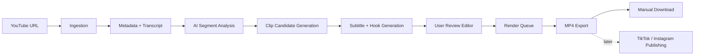

# clippingAI

clippingAI is an AI-assisted platform for turning long YouTube videos into short, editable, captioned clips for TikTok, Instagram Reels, YouTube Shorts, and other short-form channels.

The first version focuses on one clear workflow:

1. Paste a YouTube URL.
2. Analyze the video transcript and structure.
3. Detect high-potential 30-60 second segments.
4. Generate hooks, captions, titles, descriptions, and subtitles.
5. Let the user review and edit each clip.
6. Export production-ready videos.

Direct publishing to TikTok and Instagram is intentionally planned as a later phase because it requires platform OAuth, API review, account permissions, and publishing constraints.

## Product Thesis

Most AI clipping tools optimize for speed: upload a long video and receive many generated shorts. clippingAI should optimize for creator control and repeatable quality.

The opportunity is not just "generate clips with AI". Existing tools already do that. The stronger angle is:

- make clip selection explainable,
- make edits fast after AI generation,
- preserve the creator's tone and brand style,
- score clips against a repeatable content strategy,
- learn from previous accepted/rejected clips,
- provide a clear approval workflow before export or publishing.

## MVP Scope

### Included

- YouTube URL input.
- Video metadata extraction.
- Transcript extraction or transcription.
- AI segment detection.
- Clip candidates between 30 and 60 seconds.
- Hook generation for each clip.
- Subtitle generation and styling.
- Basic timeline editor for trimming, captions, and hook text.
- Export to MP4 vertical format.
- Project history and clip status tracking.

### Excluded From MVP

- Direct TikTok publishing.
- Direct Instagram publishing.
- Team collaboration.
- Payments and usage billing.
- Advanced brand kits.
- Multi-language dubbing.
- Fully automated posting.

These should come after the core pipeline reliably creates good clips.

## Suggested Stack

The architecture is designed so the AI, rendering, and publishing systems can evolve independently.

- Frontend: Next.js, React, TypeScript, Tailwind CSS.
- Backend API: FastAPI or NestJS.
- Database: PostgreSQL.
- Job queue: Redis + BullMQ, Celery, or Temporal.
- Object storage: S3-compatible storage.
- Video processing: FFmpeg.
- Transcription: Whisper API, local Whisper, or another speech-to-text provider.
- AI reasoning: OpenAI API by default, with an abstraction layer for alternative providers.
- Authentication: Clerk, Auth.js, or Supabase Auth.
- Payments later: Stripe.

## Core Pipeline



## Repository Structure

```text
clippingAI/
  README.md
  docs/
    ARCHITECTURE.md
    PRODUCT_REVIEW.md
```

## Local POC

The repository now includes a minimal Vercel-ready Next.js POC.

### What Works

- Paste a YouTube URL.
- Start an async analysis job and poll progress from the UI.
- Fetch public YouTube captions when available.
- Send the transcript to Gemini.
- Fall back to Gemini direct video analysis for async jobs when captions are missing.
- Generate 5-8 candidate clips.
- Edit hooks, subtitles, and titles in the browser.
- Preview the selected timestamp in an embedded YouTube player.
- Download a local MP4 export for each clip.
- Transcribe the selected clip audio with Whisper for spoken subtitles.
- Burn progressive word-by-word captions into local MP4 exports.
- Fill vertical exports with a blurred video background instead of black bars.
- Export the clip plan as JSON.

### What Does Not Work Yet

- MP4 export is still a POC path. Vercel can run the packaged `ffmpeg` and `yt-dlp`
  binaries, but YouTube may block downloads from datacenter IPs.
- For Vercel MP4 export reliability, set `YOUTUBE_COOKIES_BASE64` with a base64
  encoded Netscape-format YouTube cookies file. The route writes it to a temporary
  file and passes it to `yt-dlp --cookies`.
- It does not save projects in a database.
- It does not publish to TikTok or Instagram.
- The synchronous `/api/analyze` route is still optimized for public YouTube
  captions. The UI now uses async jobs so videos without captions can use the
  slower Gemini direct video fallback without blocking the initial request.
- Async jobs use in-memory state by default, which is fine locally but not fully
  reliable on serverless. For Vercel preview/production, add Upstash Redis env
  vars so job progress/results survive between function invocations.

### Setup

```bash
npm install
cp .env.example .env.local
python3 -m venv .venv
.venv/bin/pip install yt-dlp
```

Add a Gemini API key:

```env
AI_PROVIDER=gemini
GEMINI_API_KEY=your_gemini_key
```

For Vercel async job state, add these optional Redis variables:

```env
UPSTASH_REDIS_REST_URL=https://your-redis.upstash.io
UPSTASH_REDIS_REST_TOKEN=your_upstash_token
```

Without Redis, the async flow can still work locally. On Vercel, polling may hit
a different function instance and lose the in-memory job state.

Run locally:

```bash
npm run dev
```

MP4 export uses the local `.venv/bin/yt-dlp` binary when present, `whisper` for
automatic speech transcription, and `ffmpeg` from your system path. This is not
production-ready for Vercel serverless; a real deployment should move rendering
to a worker service.

The generated MP4 is not saved in the repository or a database. The API returns
the file directly to the browser, so it is saved wherever the browser normally
puts downloads, usually the user's `Downloads` folder.

Word-by-word captions use Whisper word timestamps when speech is detected in the
clip. If Whisper fails or finds no words, the renderer falls back to estimated
timing from the generated subtitle text and clip duration.

Caption rendering groups words by Whisper segment, pauses, punctuation, and
short maximum line length. It keeps captions to one short line at a time to
avoid overlapping phrases and uncontrolled wrapping.

Some YouTube URLs may block local MP4 export with a bot/authentication check.
For a reliable production flow, add one of these ingestion paths:

- user uploads the source file,
- user connects their own YouTube account,
- renderer uses authenticated cookies for user-owned videos.

### Async Analysis Flow

The UI no longer waits on `/api/analyze` directly:

1. `POST /api/analyze-jobs` creates a queued job and returns `jobId`.
2. The browser starts `POST /api/analyze-jobs/:jobId/run` in the background.
3. The browser polls `GET /api/analyze-jobs/:jobId` for status and progress.
4. The worker tries public captions first.
5. If captions exist, Gemini analyzes the compact transcript.
6. If captions are missing, Gemini analyzes the YouTube video directly.
7. Completed jobs return the same clip candidate payload used by the editor.

This is enough for a hosted POC, but the production version should move the
`:jobId/run` worker to Railway, Render, Fly.io, or another container runtime.
That worker can then download audio, run Whisper/faster-whisper for exact
transcription, and call Gemini/OpenAI on the transcript without Vercel function
timeouts.

Open:

```text
http://localhost:3000
```

### AI Provider Notes

Gemini is the active provider for the POC because it has a usable free tier for tests. An OpenAI provider stub is kept in `src/lib/ai/openai.example.ts` for later, when OpenAI API credits are available.

Application code should stay behind the `analyzeTranscript` provider interface so Gemini, OpenAI, Groq, or OpenRouter can be swapped without rewriting the product flow.

## Important Platform Constraints

YouTube ingestion must be handled carefully. The safest product path is to require the user to own the content, have permission to process it, or upload the source file directly. YouTube URL support should be treated as a convenience layer, not the only ingestion path.

TikTok direct publishing is possible through TikTok's Content Posting API, but it requires a registered app, approved scopes such as `video.publish`, creator authorization, and app audit before public posting behavior is fully available.

Instagram publishing should be treated similarly: direct Reels publishing requires Meta platform integration, OAuth, eligible account types, and Graph API constraints.

## Competitive Positioning

Existing products such as OpusClip and quso.ai already provide AI clipping, subtitles, resizing, and social media workflows. clippingAI should not compete by copying the same broad suite immediately.

Better initial positioning:

- for creators who want high editorial control,
- for agencies that need reviewable outputs,
- for educators, podcasters, and founders who care about message accuracy,
- for users who want transparent AI reasoning behind each suggested clip.

## Development Phases

### Phase 1: Foundation

- Build project model, YouTube URL intake, transcript pipeline, AI clip planning, and exportable clip specs.

### Phase 2: Rendering

- Add FFmpeg rendering, subtitle burn-in, vertical layout, safe zones, and downloadable MP4 files.

### Phase 3: Editor

- Add a browser editor for trimming, captions, hook text, title suggestions, and clip approval.

### Phase 4: Learning Loop

- Track accepted/rejected clips and use that feedback to improve future recommendations.

### Phase 5: Publishing

- Add TikTok and Instagram OAuth, API approval flows, scheduled publishing, and post status tracking.

## Research Sources

- TikTok Content Posting API: https://developers.tiktok.com/doc/content-posting-api-get-started/
- OpusClip: https://www.opus.pro/
- quso.ai / vidyo.ai: https://quso.ai/
- Instagram Platform docs: https://developers.facebook.com/docs/instagram-platform/
