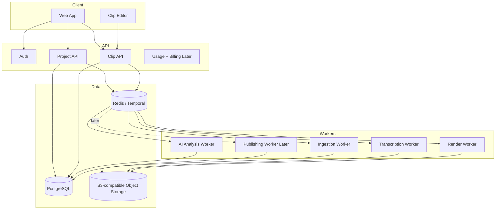

# Architecture

## Goals

clippingAI should be built around asynchronous media processing. Video ingestion, transcription, AI analysis, rendering, and publishing are slow, failure-prone operations. The user interface should never wait on them directly.

The platform should support three levels of output:

1. Clip plan: timestamps, reason for selection, hook, caption script, title, and hashtags.
2. Editable draft: clip with subtitles and editable overlays.
3. Rendered asset: final MP4 ready for download or publishing.

## System Overview



## Main Services

### Web App

Responsibilities:

- YouTube URL input.
- Project dashboard.
- Clip candidate review.
- Timeline editor.
- Subtitle and hook editing.
- Export/download UI.
- Later: TikTok and Instagram account connection.

Suggested implementation:

- Next.js App Router.
- React Server Components for dashboard views.
- Client components for editor and playback.
- Tailwind CSS for speed.
- Video preview with HTML5 video first; specialized timeline library only when needed.

### API

Responsibilities:

- User authentication.
- Project CRUD.
- Clip CRUD.
- Job creation and status polling.
- Signed upload/download URLs.
- AI provider configuration.
- Usage tracking.

Suggested implementation options:

- FastAPI if the video/ML pipeline is Python-heavy.
- NestJS if the team prefers TypeScript end to end.

For this product, FastAPI is a pragmatic first choice because FFmpeg orchestration, transcription, and media tooling are often smoother in Python.

### Workers

Workers should be isolated from the request/response API.

Worker types:

- `ingest`: resolves source metadata and stores the source media or source reference.
- `transcribe`: creates timestamped transcript segments.
- `analyze`: asks the LLM to find candidate clips and explain why they work.
- `render`: produces MP4 files with captions, crop, layout, and overlays.
- `publish`: later, sends approved clips to TikTok or Instagram.

Each worker should write structured progress events so the UI can show meaningful states.

## Data Model

### User

- `id`
- `email`
- `name`
- `auth_provider`
- `created_at`

### Project

- `id`
- `user_id`
- `source_type`: `youtube_url`, `file_upload`
- `source_url`
- `source_title`
- `source_duration_seconds`
- `status`: `created`, `ingesting`, `transcribing`, `analyzing`, `ready`, `failed`
- `created_at`
- `updated_at`

### TranscriptSegment

- `id`
- `project_id`
- `start_ms`
- `end_ms`
- `text`
- `speaker_label`
- `confidence`

### Clip

- `id`
- `project_id`
- `start_ms`
- `end_ms`
- `duration_seconds`
- `status`: `candidate`, `approved`, `rendering`, `rendered`, `rejected`, `failed`
- `score`
- `selection_reason`
- `hook_text`
- `title`
- `description`
- `hashtags`
- `created_at`
- `updated_at`

### ClipEdit

- `id`
- `clip_id`
- `trim_start_ms`
- `trim_end_ms`
- `caption_style`
- `caption_overrides_json`
- `overlay_json`
- `aspect_ratio`: `9:16`, `1:1`, `16:9`
- `safe_zone_profile`: `tiktok`, `instagram`, `youtube_shorts`

### Render

- `id`
- `clip_id`
- `status`
- `storage_url`
- `thumbnail_url`
- `render_settings_json`
- `created_at`

### SocialAccount Later

- `id`
- `user_id`
- `platform`: `tiktok`, `instagram`
- `external_account_id`
- `access_token_encrypted`
- `refresh_token_encrypted`
- `scopes`
- `expires_at`

### PublishJob Later

- `id`
- `clip_id`
- `social_account_id`
- `platform`
- `status`
- `scheduled_at`
- `external_publish_id`
- `error_message`

## AI Design

The AI layer should not be hardcoded directly into business logic. Use a provider interface:

```text
AIProvider
  analyzeTranscript(project, transcript) -> ClipCandidate[]
  generateHook(clipContext) -> HookSuggestion[]
  generateCaptionMetadata(clipContext) -> TitleDescriptionHashtagSet
  critiqueClip(clipDraft) -> ClipQualityReview
```

Initial provider:

- OpenAI API with user-provided API key or platform-owned key.

Future providers:

- Anthropic, Gemini, local models, or specialized video understanding models.

Recommended prompt outputs should be JSON-schema validated. Clip candidates should always include:

- timestamp range,
- confidence score,
- reason for selection,
- detected emotion or tension,
- proposed hook,
- suggested caption angle,
- risk flags such as missing context or copyrighted music.

## Video Processing

Use FFmpeg for rendering.

Core render features:

- cut source by timestamp,
- crop/reframe to 9:16,
- burn subtitles,
- add hook overlay,
- normalize audio,
- generate thumbnail,
- export MP4 H.264/AAC.

Important: do not build advanced video editing primitives from scratch. Use FFmpeg for media operations and store edit decisions as structured JSON.

## YouTube Ingestion Strategy

YouTube URL support is commercially useful but legally and technically sensitive. Recommended ingestion order:

1. User uploads their own original file.
2. User connects their YouTube account and selects their own videos.
3. User pastes a YouTube URL and confirms they have the right to process it.

The architecture should support both `youtube_url` and `file_upload` from day one so the product is not dependent on fragile URL extraction.

## Publishing Strategy

Direct publishing should be a separate bounded context.

Do not couple clip rendering with social publishing. A rendered clip should be reusable regardless of whether the platform API is available.

TikTok direct posting requires:

- TikTok developer app,
- Content Posting API product,
- approved scopes such as `video.publish`,
- target user authorization,
- app audit for normal public behavior.

Instagram Reels publishing requires:

- Meta developer app,
- Instagram/Graph API integration,
- eligible professional or creator account flows,
- OAuth token storage,
- media container creation and publish flow.

## Security

Minimum requirements:

- encrypt user API keys and social tokens,
- never log raw tokens,
- sign media URLs,
- isolate render workers from the public API,
- scan uploads where possible,
- keep AI prompts free of secrets,
- add explicit user rights confirmation for third-party videos.

## Failure Handling

Expected failures:

- invalid YouTube URL,
- unavailable captions,
- transcription timeout,
- AI JSON parse failure,
- render failure,
- expired social token,
- TikTok or Instagram API rejection,
- source video too long or too large.

Every job should have:

- retry policy,
- max attempts,
- structured error,
- user-facing recovery action.

## MVP Build Order

1. Project creation from URL or file upload.
2. Transcript generation.
3. AI clip candidate generation.
4. Clip review dashboard.
5. Basic editor for trims and text.
6. FFmpeg rendering.
7. Download final clip.
8. Feedback loop.
9. Social publishing integrations.
